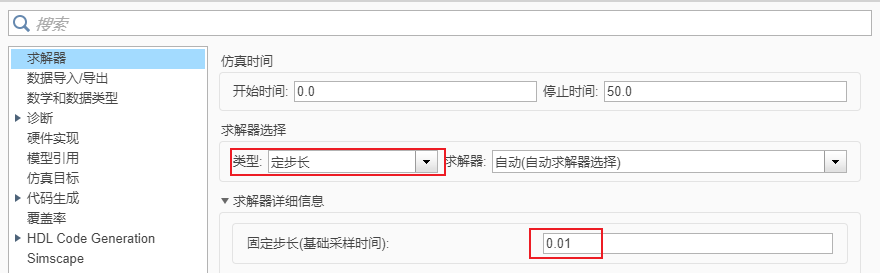
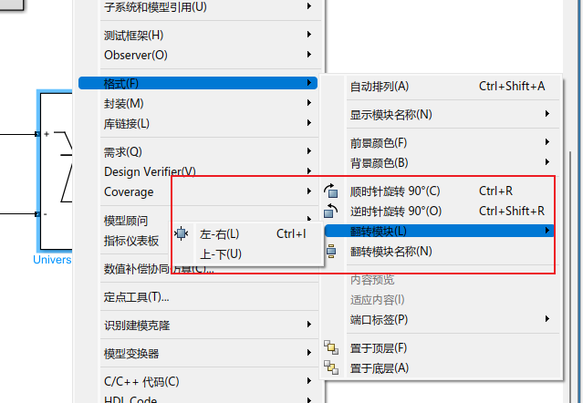
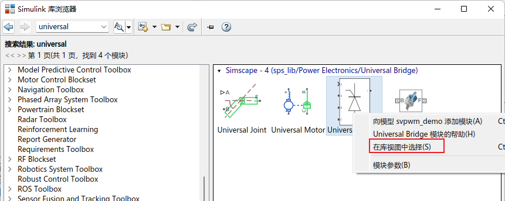
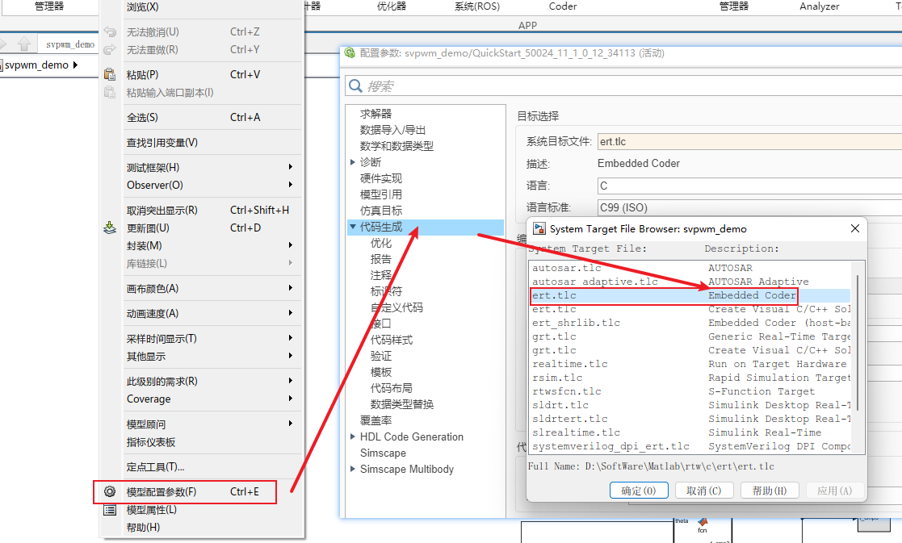
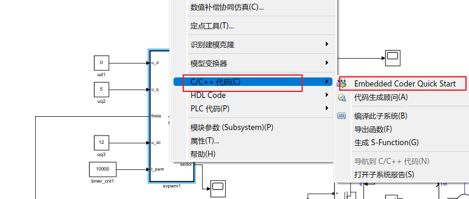
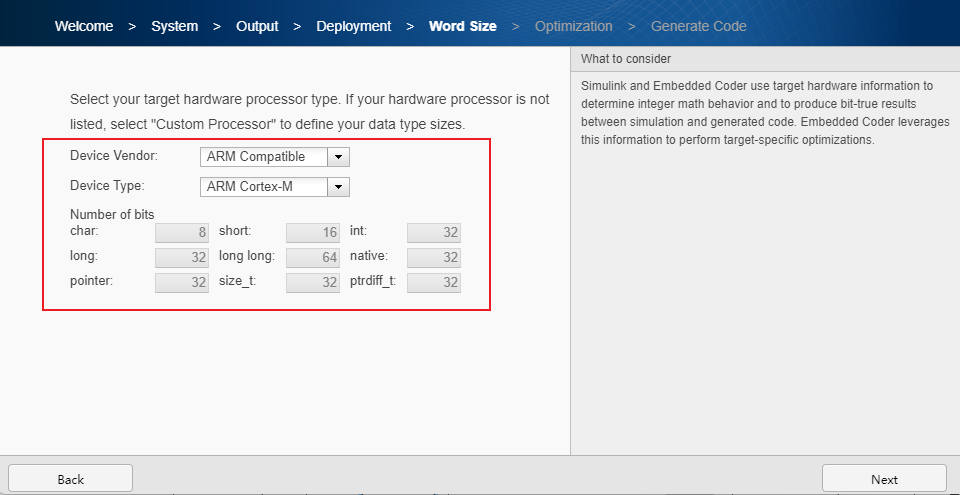

# simulink notes

## 调整仿真步长

鼠标右键 ---> 模型配置参数 ---> 定步长 + 固定步长（越小越清晰）

## 工件的翻转与镜像

右键 ---> 格式 ---> 旋转、翻转。

## 在库浏览器当中寻找这一类器件

- 先通过搜索找到对应的器件。
- 然后在视图当中进行展开即可。

## 模型当中使用到的模块

- Constant：常量
- Clock：y = x线性的变量
- **Matlab Function**：自定义函数
- **Subsystem**：自定义逻辑系统
  - Repeating Sequence：三角波
  - Add： 加法模块，双击可以定义符号列表，从而变成减法模块。
  - Relay：相当于限幅模块，将 add 模块输出的值，限幅为 0 或者1。
  - Unit Delay：采样延时模块。
  - Logical Operator：逻辑操作运算，与或非。
  - Mux：多路复用器

- 电力电子相关外设：
  - Universal Bridge：三相逆变器。双击进去，在 Power Electronic device 当中旋转 “MOSFET / Diodes”
  - Ground：地
  - DC Voltage Source：直流电源
  - Permanent Magnet Synchronous Machine：永磁同步电机。Paramagnetics 设置
    - Stator phase resistance Rs：0.485
    - Machine constant：Voltage Constant（5.21657）
    - Inertia， viscous damping， pole pairs，：[0.00007 0.04924 7 0]
    - Rotor flux position 
  - **power gui**：分别有三种模式：连续方法（continous）、离散方法（discrete）、相量方法（phasor）。
    - 如果设置的连续模式，则需要在设置当中指定仿真步长（10e -6）
    - 如果设置离散方式，其会让指定一个步长；那么设置当中则可以设置为自适应步长。

## 生成代码

空白部分右键修改属性：ert.tlc

右键对应的函数功能块：

配置平台：

